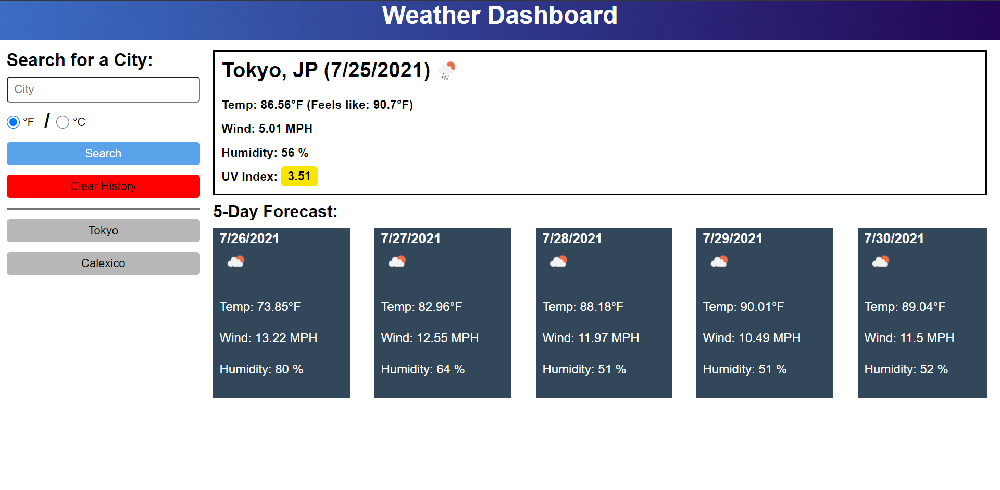
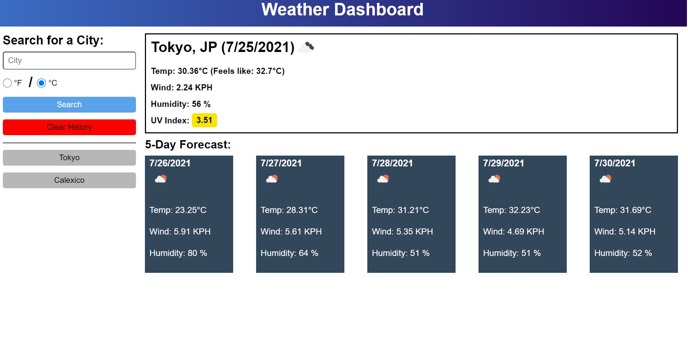

# Weather-Dashboard

## Weather-Dashboard Requirements
 Code a simple weather dashboard using Server Side APIs (Openweather);

 ### Weather-Dashboard Grading Criteria:
        - [✔️] Search for a city in a search and get results from Openweather.
        - [✔️] Organize Openweather response in current and forecast weather.
        - [✔️] Current weather shows City Name, Weather Icon, Date, Date, Temp, Wind Speed, Humidity, UV Index.
        - [✔️] UV Index is color coded to show risk.
        - [✔️] Forecast shows 5 day.
        - [✔️] Forcast cards have date, icon, temp wind speed and humidity.
        - [✔️] History of searches is kept and saved in local storage.
        - [✔️] History is displayed as buttons under search bar.

 ### Weather-Dashboard Enhancements:
        - [✔️] Added capability of choosing units.
        - [✔️] History will only save last 10 searches any more will be overwritten.
        - [✔️] Clicking on history will search for clicked city.
        - [✔️] Added Clear History button to delete history.
        - [✔️] Clicking the UV Index value will open tab with more information. 

Please see link below for Weather-Dashboard accessible URL: 
        https://darkjuanjo.github.io/weather-dashboard/
        
**Below is the source code for the Weather-Dashboard in GitHub. Please note that code is in assets/js. **
        https://github.com/darkjuanjo/weather-dashboard

## See below for some screenshots

### Dashboard - Imperial Units

### Dashboard - Metric Units

